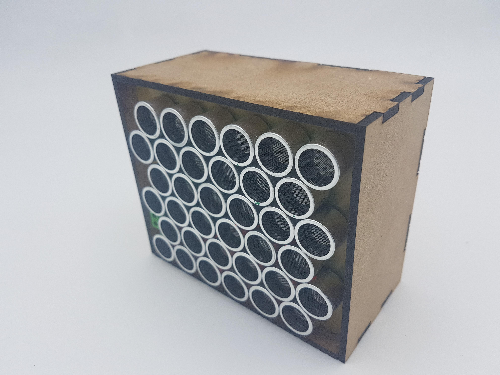
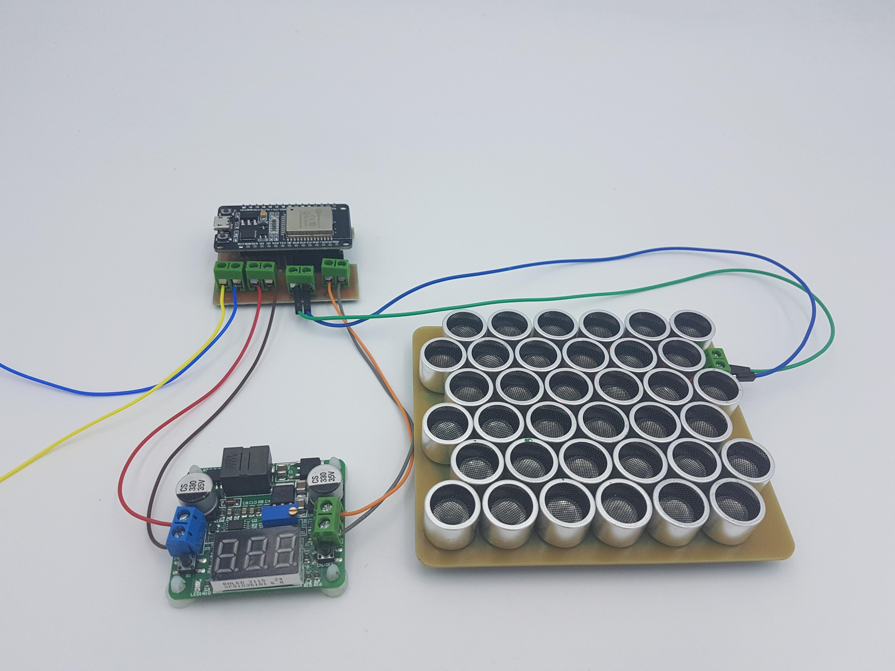
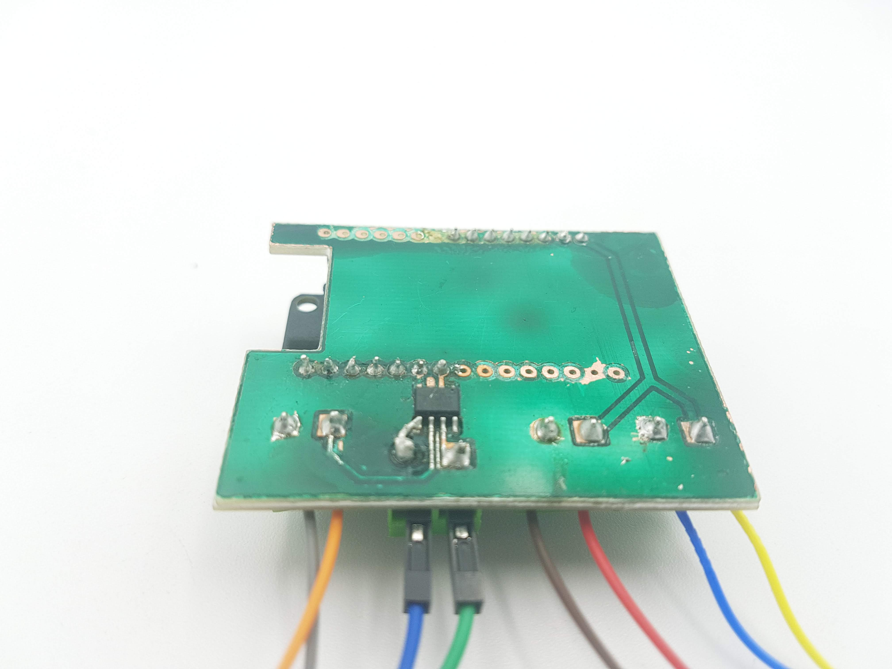
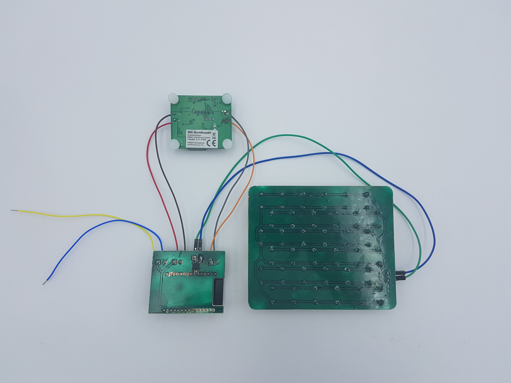

## Bluetooth Phased Array Directional Speaker

This repository contains the source code and hardware schematics for a Bluetooth phased array directional speaker built using ESP32 and ESP-IDF.

The project aims to create a speaker that can project a beam of sound in a specific direction using a phased array, allowing for a more targeted listening experience. The speaker is connected via Bluetooth to any compatible device, such as a smartphone or laptop.

<!--  

 -->

<table>
  <tr>
    <td></td>
    <td></td>
  </tr>
  <tr>
    <td></td>
    <td></td>
  </tr>
</table>

## Installation and Usage

To use this project, you_box.jpg)

## Installation and Usage

To use this project, you will need an ESP32 development board and the ESP-IDF development framework installed on your machine. You can find instructions for installing ESP-IDF with PlatformIO [here](https://docs.platformio.org/en/latest/plus/debugging.html#advanced-configuration).

Once you have ESP-IDF installed with PlatformIO, you can clone this repository and open it in Visual Studio Code with the PlatformIO extension. From there, you can build and flash the firmware to your ESP32 board using the PlatformIO toolbar.

The code for the project can be found in the `Code_Phased_Array_Speaker_esp_idf` directory, and the KiCad files for the hardware can be found in the `Kicad_Phased_Array_Speaker` directory.

After flashing the firmware, you can connect your Bluetooth device to the speaker and begin playing audio. The speaker will project sound in the direction indicated by the phased array.

## Project Structure

The project is organized as follows:

- `Code_Phased_Array_Speaker_esp_idf` directory contains the main application code
- `Kicad_Phased_Array_Speaker` directory contains the hardware schematics and PCB layout files

